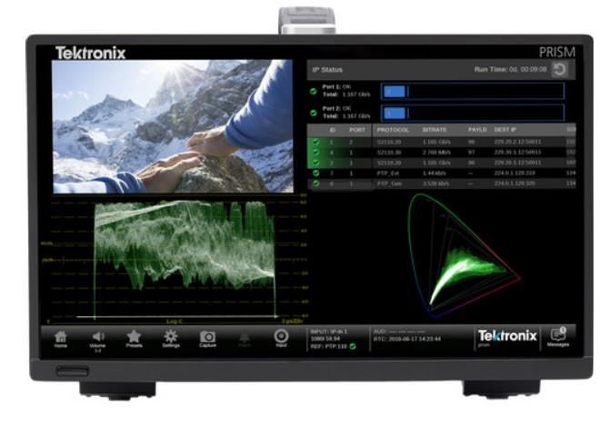

## Useability Engineering Journal

### Will Simpson - 10-14-2022

In my day job, a staple device for analyzing video signals is something called a Wave Form Analyzer. The Tektonix WFM 8300 (Now owned by Telestream). A WFM, WaveForm Monitor is a special type of oscilloscope used for evaluating broadcast video signals. The WFM8300 was the very top of the line about 10 years ago. Priced around $30,000 it was a device that required a decent business case to purchase. 

The simple explanation is the WFM 8300 is used to analyze up to two channels of a given video stream up to 3Gb/s. The world of video is measured in how much data is transmitted in a specific format. 10 Bit YUV video with a raster size of 1920x1080 at up to 60 frames per second fits in a 3Gb/s container. 12 Bit RGB with a raster size of 2048x1080 at up to 30 frames also fits in a 3Gb/s container. In both scenarios 

 The UI reports a variety of information about the video signal, rate, raster, color space, payload ID and many many other things. Front panel interaction is handled through a series of buttons that represent a section. You hold down each button to get a sub menu of each of those sections. It took me a long time to understand how to hunt through the UI. The menu organization also doesn’t make a lot of sense. It feels like a case where the UI was handled by engineers and it was implemented based on the engineers as the users.

Over time we moved on to using a SNMP interface to extract useful information from the scope using python. With this, we are able to iterate through many video formats and compare against stored values. This helped us evolve our QA process from point and click, hunt and peck  evaluation of the scope to full blown automation.

Like basically all forms of electronic based technology, products come and go. In our QA process, there is some recent pain for us. The WFM 8300 we have all come to know and love is being replaced by another device called Prism. The Prism appears to be the epitome of a cost cutting approach to a very expensive high end product that the WFM 8300 was in its day. The Prism is basically a Centos Linux system based on a Micro ATX chassis, a touch screen and video IO in the back. The UI brings a new level “clunky” to the menu system. Entering information in any field with the touch screen is incredibly cumbersome. As I sat with a guy demoing the product at a tradeshow and he himself said, “this is what happens when non user design a UI.”

The biggest hurdle for us in QA will be reworking the existing SNMP based automation to use the RESTful interface of the new Prism scope. This is hopefully a positive transition as REST has proven to be more robust than previous technologies.
