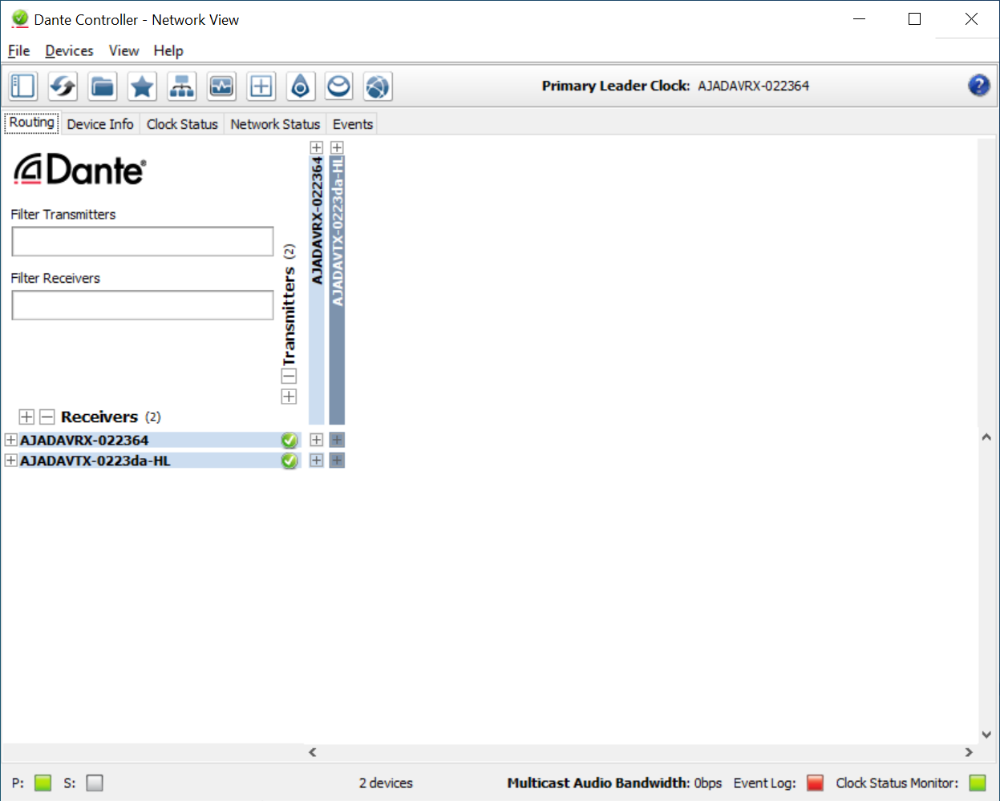
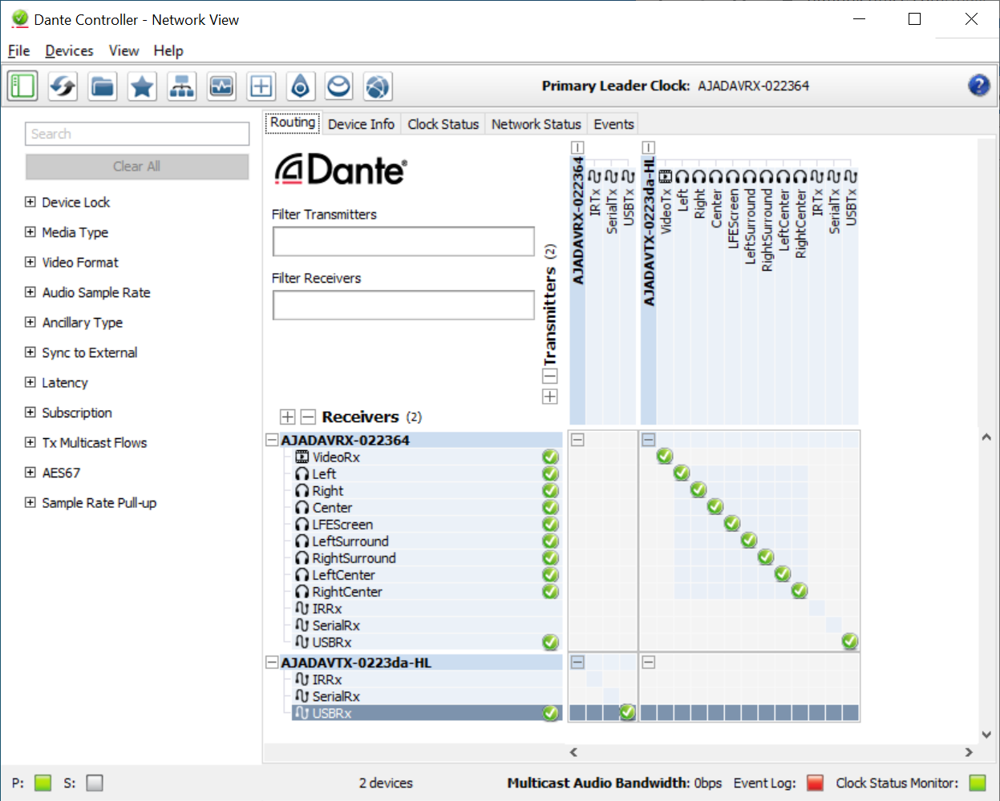

Useability Engineering Journal # 2 - Audinate and the Dante Controller Workflow

The latest technical hurdle I’ve been presented with is Dante AV. Dante is a module that can easily be added to a company's video or audio I/O device. The network behavior is quite impressive and the requirements of any Dante device I’ve come across is minimal.  the founding company has put a lot of effort behind the ease of access to training and familiarization. The ability to packetize and transmit across the network Audio, Video and even PC peripheral ports has me pretty amazed. As I’ve gone through the training (For which I am now “Level 3” certified) I continue to see new and creative ways to apply and leverage this new technical wonder. All of this fabulous excitement and momentum was sorely stifled when I got to the control interface - Welcome to Dante Controller:

At first glance I thought, “Huh, now that's an interesting approach to some universal signal routing problems and how best to represent it in a UI. Video routers and other such devices have a common Source and Destination paradigm that is in many ways, an industry adopted standard. As we discussed in class, breaking away from such standards needs to be done REALLY REALLY well or it just falls flat when users try to adopt a different approach  to an otherwise common task done the same way all over different devices in an industry for decades now.

So after fumbling around with some of the initial clunkiness I finally got some things setup, Audio and video flowing and so on. The Affordances of the UI offered enough to dive in. One side is one set and so on. When I spun things open, mapping was out the window. The fact that the (TX) senders and (RX) receivers were both listed in both lists.  Though it is learnable, the cross hatch routing approach took a great deal of getting used to. The tilting of my head to the left to read the Transmitter selection labels is something I just can’t seem to get used to. A software bug in the Filtering removed the opposite items that it should have so I was even more lost. In going back to revisit some of the earlier SEEMULES concepts, it helped to give some context to what I was feeling about the user experience.  

Was it Satisfying? Seeing the hour glass to turn to a green check mark, absolutely satisfying and was it effective? Sure… But efficient, I wouldn’t say so and compared to other routing control systems it definitely wasn’t easy. It was memorable alright, but maybe not for the right reasons. I’ve had 2 solid days of testing in my role as a QA Engineer. We are gearing up for compliance testing and CE certification next week so I’m going to not only further immerse myself in it from my side for testing but then have to walk CE lab technicians through any difficulties they may have. This is going to be fun! 
